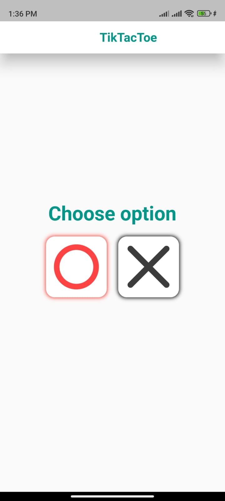
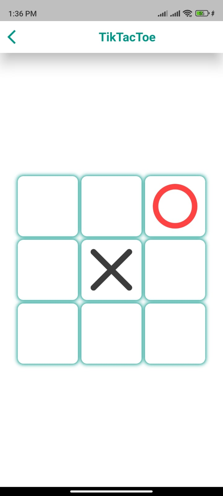
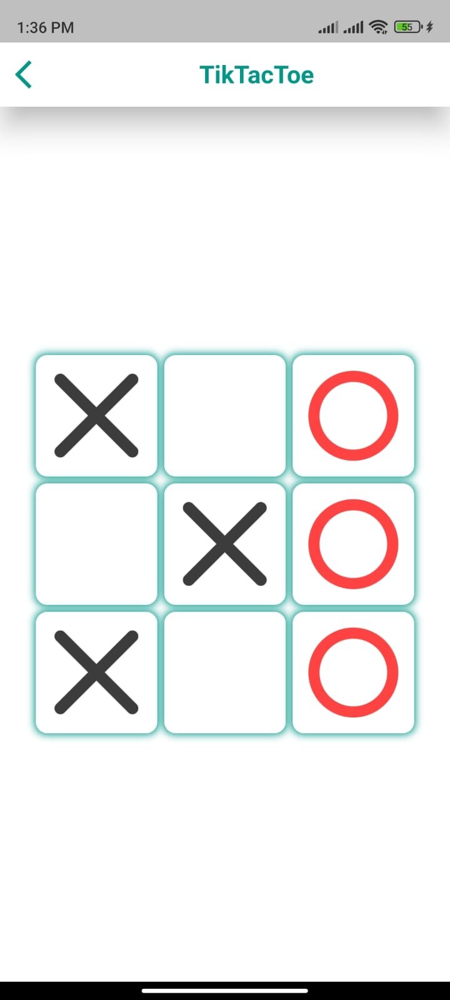

# Tic-Tac-Toe Game

Welcome to the Tic-Tac-Toe Game project! This Flutter application allows you to play the classic Tic-Tac-Toe game against a computer opponent.

## Table of Contents

- [Screenshots](#screenshots)
- [Getting Started](#getting-started)
- [Features](#features)
- [Computer AI](#computer-ai)
- [License](#license)

## Screenshots

Here are some screenshots from the Tic-Tac-Toe game:

### Main Screen

The main screen allows you to choose your player type (circle or cross) before starting the game.

### Gameplay

The gameplay screen displays the Tic-Tac-Toe board, and you can take turns playing against the computer opponent.

## Getting Started

To run this project on your local machine.
Make sure you have Flutter and Dart installed on your system.

## Features

- Choose your player type (circle or cross) at the beginning of the game.
- Play against a computer opponent that makes random moves (basic AI).
- Win the game by completing a row, column, or diagonal with your player type.
- Enjoy a simple and intuitive user interface.

## Computer AI

The computer opponent in this game uses a basic AI that makes random moves. To improve the AI's intelligence, you can implement more advanced algorithms to make it a more challenging opponent.

## License

This project is licensed under the MIT License - see the [LICENSE](LICENSE) file for details.

